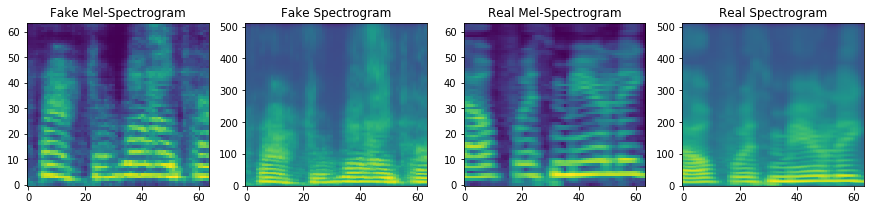

# Attacking Speaker Recognition Systems with Deep Generative Models

PyTorch implementation of [Attacking Speaker Recognition Systems with Deep Generative Models](https://arxiv.org/pdf/1801.02384.pdf). 

## Pre-requisites
1. NVIDIA GPU + CUDA cuDNN

## Data and pre-trained models:
1. Audio data: `https://drive.google.com/open?id=1SWHhtyeFWo1cwDBOXXbfssa3Z9TTyPsw`
2. Pre-trained models for Cathy (Blizzard): `https://drive.google.com/open?id=1tB9ogHA1IzXyW6NOZ7SiZjVhK2_1FkJX`

## Setup
1. Clone this repo: `git clone https://github.com/NVIDIA/tacotron2.git`
2. CD into this repo: `cd asrgen`
3. Download and unzip audio data into this repo
4. Install python requirements: `pip install -r requirements.txt`

## Training
1. `python gan_train.py`
2. (OPTIONAL) `tensorboard --logdir=./`

## Synthesize audio samples with a Generator
1. `jupyter notebook --ip=127.0.0.1 --port=31337`
2. load `gan_synthesis.ipynb`	

## Acknowledgements
This implementation uses code from the following repos: [NVIDIA's Tacotron 2] (https://github.com/nvidia/tacotron2), [Martin Arjovsky](https://github.com/martinarjovsky/WassersteinGAN) and [Prem
Seetharaman](https://github.com/pseeth/pytorch-stft).

We are thankful to Prem Seetharaman and Markus Rabe for their feedback on the early draft of this paper.

